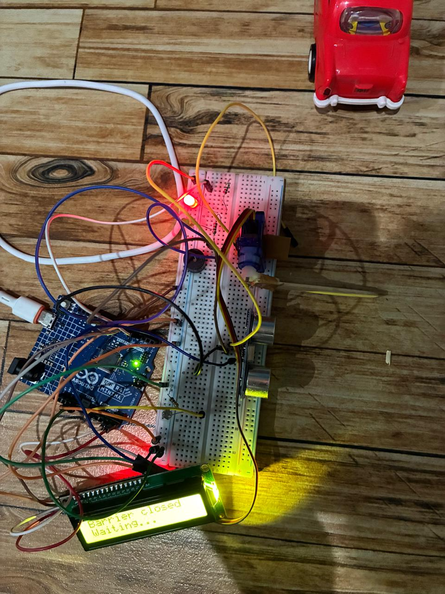
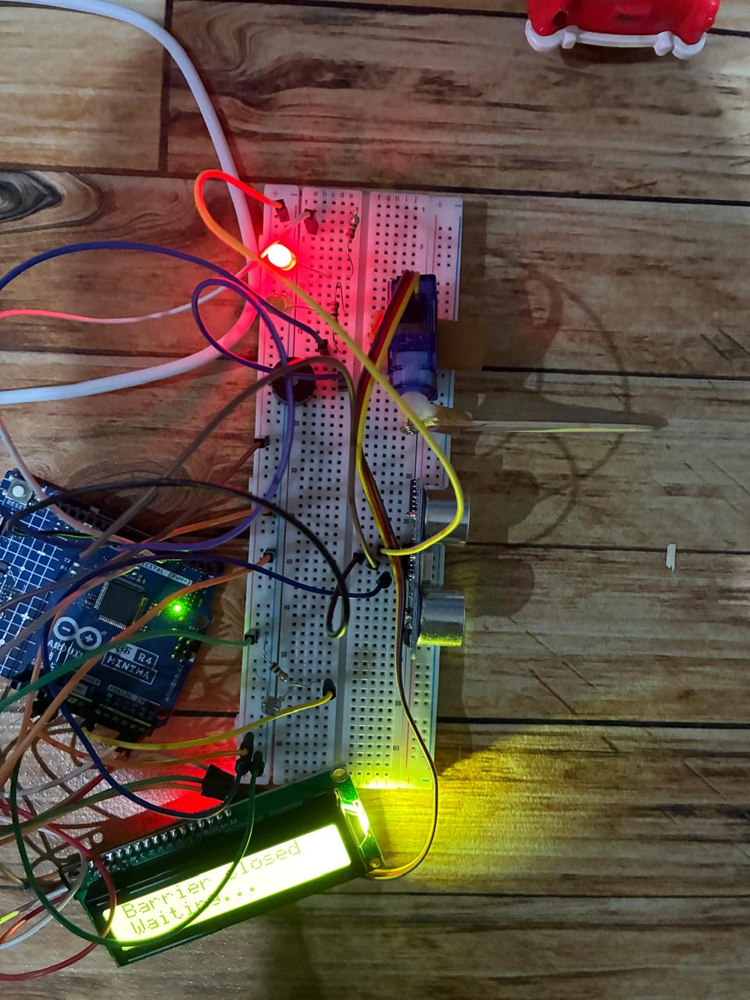
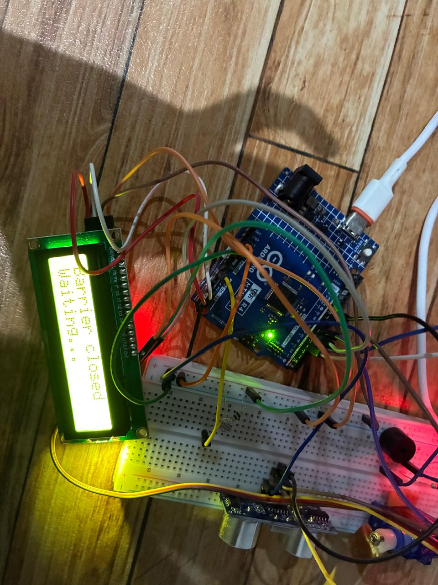

# Smart Parking Barrier

An automated parking barrier built with an Arduino UNO R4 Minima. It detects
an approaching vehicle, raises the boom, waits for the vehicle to clear, and
lowers the boom again — entirely on its own, with no manual intervention.

## Demo

The barrier assembled on its breadboard, with the servo boom, ultrasonic
sensor, LCD, buzzer, and LED all wired up and idling in the closed state.

[Watch the demo video](media/demo-video.mp4) — shows a vehicle approaching,
the barrier opening, the vehicle passing through, and the barrier closing
automatically.

## How it works

The system is built as a **non-blocking finite state machine** with five states:

| State | What's happening |
|---|---|
| `IDLE` | Barrier down, red LED on, watching for an approaching vehicle |
| `OPENING` | Vehicle detected within range — servo raises the boom, buzzer beeps, green LED on |
| `WAIT_PASS` | Boom fully open, watching the exit sensor for the vehicle to clear |
| `CLEARING` | Vehicle confirmed clear — short hold before closing |
| `CLOSING` | Servo lowers the boom back down, buzzer beeps, red LED back on |

**Entry detection:** an HC-SR04 ultrasonic sensor measures distance
continuously. Anything within `DETECT_DISTANCE_CM` (20cm by default) counts
as an approaching vehicle.

**Exit detection:** an LDR (light-dependent resistor) wired as a voltage
divider watches for a vehicle blocking light as it passes underneath. On
startup, the sketch samples ambient light for a moment to set a baseline, so
it adapts to whatever room it's running in rather than relying on a fixed
threshold. The moment the reading dips far enough below that baseline
(`LDR_MARGIN`), the vehicle is considered "passing." Rather than waiting for
the light to climb back to an exact value to confirm it's fully clear —
which proved unreliable in practice, since ambient lighting drifts and
readings hover noisily near any fixed line — the barrier instead waits a
fixed transit delay (`PASS_CLEAR_DELAY_MS`) after the shadow is first
detected, then treats the vehicle as clear. This is more robust for a small
object briefly passing over the sensor.

**Safety timeout:** if a vehicle is detected but the exit sensor never
confirms it's passed (e.g. sensor blocked, vehicle reversed away), the
barrier closes automatically after 10 seconds rather than staying open
indefinitely.

The whole loop avoids `delay()` entirely, using `millis()`-based timers
instead. That's what lets the ultrasonic sensor, the LDR, the servo sweep,
the LCD, and the buzzer all stay responsive at the same time, instead of the
code blocking on one task while ignoring the others.

## Hardware used

- Arduino UNO R4 Minima
- HC-SR04 ultrasonic sensor (entry detection)
- LDR + 10kΩ resistor, wired as a voltage divider (exit detection)
- SG90 micro servo (boom arm)
- 16x2 I2C LCD (status display)
- Active buzzer
- Red + green LEDs with 220Ω resistors (status indicators)
- Breadboard, jumper wires, battery holder

## Wiring

| Component | Arduino Pin |
|---|---|
| HC-SR04 TRIG | D9 |
| HC-SR04 ECHO | D10 |
| LDR divider junction | A0 |
| Servo signal | D6 |
| Buzzer | D7 |
| Red LED | D4 |
| Green LED | D5 |
| LCD SDA | A4 |
| LCD SCL | A5 |

All modules share the Arduino's 5V and GND rails via the breadboard's power
rails.

## Software setup

1. Install the Arduino IDE and select **Arduino UNO R4 Minima** as the board.
2. Install the `LiquidCrystal_I2C` library via **Sketch → Include Library →
   Manage Libraries**.
3. Open `smart_parking_barrier.ino`, select the correct port, and upload.
4. Open Serial Monitor at **9600 baud** to watch state transitions and the
   LDR baseline reading — useful for confirming everything's working and for
   re-tuning `LDR_MARGIN` if you rebuild this in a different lighting setup.

## Calibration note

`LDR_MARGIN` (in the sketch's tunables section) controls how big a light
drop counts as "a vehicle is here." This depends entirely on your lighting —
a well-lit LDR gives a bigger, more reliable drop than one in dim ambient
light. If you rebuild this, point a small light source (lamp or phone torch)
directly at the LDR, note the baseline and the drop when something passes
over it, and set `LDR_MARGIN` to roughly 60–70% of that observed drop.

`PASS_CLEAR_DELAY_MS` controls how long the barrier waits after detecting
the shadow before assuming the vehicle has fully cleared. Tune this to
roughly match how long your test vehicle actually takes to cross the
sensor — too short and it may close on a vehicle still underneath; too long
and it holds the barrier open longer than necessary.

## Physical build

The barrier is mounted on a cardboard base: the ultrasonic sensor sits on a
raised post facing down the "lane," the servo drives a lightweight boom arm
(an ice-cream stick) across the lane, and the LDR sits flat on the base just
past the boom, lit from above.

## Possible improvements

- Second ultrasonic sensor instead of the LDR, for exit detection that's
  independent of ambient lighting
- IR remote override for manual open/close
- Logging vehicle count over time to the Serial Monitor or an SD card
